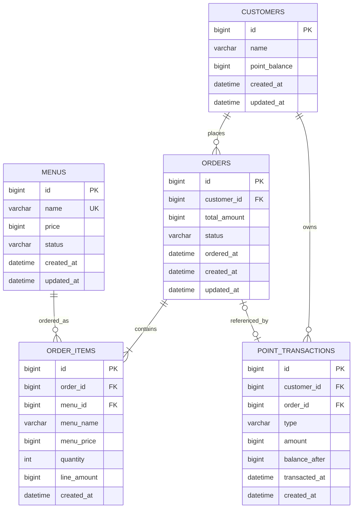

# Database Design

## 관련 정책

이 문서는 정책을 데이터 구조로 표현한다.

- 포인트 정책: `docs/policy/point.md`
- 메뉴 판매 정책: `docs/policy/menu-sales.md`
- 주문 정책: `docs/policy/order.md`
- 인기 메뉴 정책: `docs/policy/popular-menu.md`

비즈니스 규칙의 기준은 `docs/policy/`이며,
이 문서에서는 테이블, 컬럼, 관계, 제약조건과 인덱스를 정의한다.

## ERD

## 테이블별 역할

### customers

고객 정보를 저장한다. 회원가입, 로그인, 인증, 인가는 구현하지 않으므로 고객 데이터는 초기 더미 데이터로 제공하는 것을 전제로 한다.

고객별 현재 포인트 잔액은 `point_balance`에 저장한다. 포인트 이력 전체는 `point_transactions`에 저장한다.

### menus

메뉴의 현재 이름, 가격, 판매 상태를 저장한다.

판매가 중지된 메뉴도 기존 주문과의 관계를 유지하기 위해 물리적으로 삭제하지 않는 것을 기본으로 한다.

판매 가능 여부는 `docs/policy/menu-sales.md`를 따른다.

### orders

주문의 대표 정보를 저장한다. 한 주문은 한 고객에게 속하며, 여러 주문 항목을 가질 수 있다.

고객의 주문 목록 조회는 `customer_id`를 기준으로 수행한다. 인증·인가가 없으므로 DB 설계에서는 고객별 주문 소유 관계만 명확히 둔다.

### order_items

한 주문에 포함된 메뉴와 수량을 저장한다.

과거 주문 정보를 유지하기 위해 주문 시점의 메뉴 이름, 메뉴 가격, 주문 항목 금액을 함께 저장한다.

주문 정보 보존 기준은 `docs/policy/order.md`를 따른다.

### point_transactions

고객의 포인트 충전과 사용 이력을 저장한다.

`amount`, `order_id`, `balance_after`의 비즈니스 의미는 `docs/policy/point.md`를 따른다.

## 컬럼과 데이터 타입

### customers

| 컬럼 | 타입 | 설명 |
| --- | --- | --- |
| `id` | `BIGINT` | 고객 ID |
| `name` | `VARCHAR(100)` | 고객 이름 |
| `point_balance` | `BIGINT` | 현재 포인트 잔액 |
| `created_at` | `DATETIME` | 생성 일시 |
| `updated_at` | `DATETIME` | 수정 일시 |

### menus

| 컬럼 | 타입 | 설명 |
| --- | --- | --- |
| `id` | `BIGINT` | 메뉴 ID |
| `name` | `VARCHAR(100)` | 메뉴 이름 |
| `price` | `BIGINT` | 현재 판매 가격 |
| `status` | `VARCHAR(20)` | 판매 상태. `ON_SALE`, `STOPPED` |
| `created_at` | `DATETIME` | 생성 일시 |
| `updated_at` | `DATETIME` | 수정 일시 |

### orders

| 컬럼 | 타입 | 설명                                                          |
| --- | --- |-------------------------------------------------------------|
| `id` | `BIGINT` | 주문 ID                                                       |
| `customer_id` | `BIGINT` | 주문 고객 ID                                                    |
| `total_amount` | `BIGINT` | 주문 총액                                                       |
| `status` | `VARCHAR(20)` | 주문 상태. `COMPLETED`, `CANCELED`. 현재 API 범위에서는 취소 기능을 제공하지 않음 |
| `ordered_at` | `DATETIME` | 주문 일시                                                       |
| `created_at` | `DATETIME` | 생성 일시                                                       |
| `updated_at` | `DATETIME` | 수정 일시                                                       |

### order_items

| 컬럼 | 타입 | 설명 |
| --- | --- | --- |
| `id` | `BIGINT` | 주문 항목 ID |
| `order_id` | `BIGINT` | 주문 ID |
| `menu_id` | `BIGINT` | 주문한 메뉴 ID |
| `menu_name` | `VARCHAR(100)` | 주문 당시 메뉴 이름 |
| `menu_price` | `BIGINT` | 주문 당시 메뉴 단가 |
| `quantity` | `INT` | 주문 수량 |
| `line_amount` | `BIGINT` | 주문 항목 금액. `menu_price * quantity` |
| `created_at` | `DATETIME` | 생성 일시 |

### point_transactions

| 컬럼 | 타입 | 설명 |
| --- | --- | --- |
| `id` | `BIGINT` | 포인트 거래 ID |
| `customer_id` | `BIGINT` | 포인트 거래 고객 ID |
| `order_id` | `BIGINT` | 연결 주문 ID. `CHARGE`는 `NULL`, `USE`는 주문 결제 이력이므로 필수 |
| `type` | `VARCHAR(20)` | 거래 유형. `CHARGE`, `USE` |
| `amount` | `BIGINT` | 실제 포인트 증감량. 원화 금액이 아니며 `CHARGE`는 양수, `USE`는 음수 |
| `balance_after` | `BIGINT` | 거래 후 포인트 잔액 |
| `transacted_at` | `DATETIME` | 거래 일시 |
| `created_at` | `DATETIME` | 생성 일시 |

## 제약조건

### customers

| 제약 | 컬럼 | 내용 |
| --- | --- | --- |
| PK | `id` | 고객 기본키 |
| NOT NULL | `name` | 고객 이름 필수 |
| NOT NULL | `point_balance` | 현재 포인트 잔액 필수 |
| CHECK | `point_balance >= 0` | 포인트 잔액은 음수가 될 수 없음 |
| NOT NULL | `created_at`, `updated_at` | 생성/수정 일시 필수 |

### menus

| 제약 | 컬럼 | 내용 |
| --- | --- | --- |
| PK | `id` | 메뉴 기본키 |
| UNIQUE | `name` | 메뉴 이름 중복 불가 |
| NOT NULL | `name`, `price`, `status` | 메뉴 핵심 정보 필수 |
| CHECK | `price > 0` | 메뉴 가격은 0보다 커야 함 |
| CHECK | `status IN ('ON_SALE', 'STOPPED')` | 정의된 판매 상태만 허용 |
| NOT NULL | `created_at`, `updated_at` | 생성/수정 일시 필수 |

### orders

| 제약 | 컬럼 | 내용 |
| --- | --- | --- |
| PK | `id` | 주문 기본키 |
| FK | `customer_id` | `customers.id` 참조 |
| NOT NULL | `customer_id`, `total_amount`, `status`, `ordered_at` | 주문 핵심 정보 필수 |
| CHECK | `total_amount > 0` | 주문 총액은 0보다 커야 함 |
| CHECK | `status IN ('COMPLETED', 'CANCELED')` | 정의된 주문 상태만 허용 |
| NOT NULL | `created_at`, `updated_at` | 생성/수정 일시 필수 |

### order_items

| 제약 | 컬럼 | 내용 |
| --- | --- | --- |
| PK | `id` | 주문 항목 기본키 |
| FK | `order_id` | `orders.id` 참조 |
| FK | `menu_id` | `menus.id` 참조 |
| UNIQUE | `order_id`, `menu_id` | 한 주문에 같은 메뉴는 하나의 항목으로 저장 |
| NOT NULL | `order_id`, `menu_id`, `menu_name`, `menu_price`, `quantity`, `line_amount` | 주문 항목 정보 필수 |
| CHECK | `menu_price > 0` | 주문 당시 메뉴 단가는 0보다 커야 함 |
| CHECK | `quantity > 0` | 주문 수량은 0보다 커야 함 |
| CHECK | `line_amount > 0` | 주문 항목 금액은 0보다 커야 함 |
| CHECK | `line_amount = menu_price * quantity` | 주문 항목 금액은 주문 당시 단가와 수량의 곱이어야 함 |
| NOT NULL | `created_at` | 생성 일시 필수 |

### point_transactions

| 제약 | 컬럼 | 내용 |
| --- | --- | --- |
| PK | `id` | 포인트 거래 기본키 |
| FK | `customer_id` | `customers.id` 참조 |
| FK | `order_id` | `orders.id` 참조, nullable |
| UNIQUE | `order_id` | 하나의 주문에는 하나의 포인트 사용 거래만 연결 |
| NOT NULL | `customer_id`, `type`, `amount`, `balance_after`, `transacted_at` | 포인트 거래 정보 필수 |
| CHECK | `type IN ('CHARGE', 'USE')` | 정의된 포인트 거래 유형만 허용 |
| CHECK | `amount <> 0` | 0포인트 거래 불가 |
| CHECK | `(type = 'CHARGE' AND amount > 0 AND order_id IS NULL) OR (type = 'USE' AND amount < 0 AND order_id IS NOT NULL)` | 충전은 양수 포인트 증가이며 주문과 무관하고, 사용은 음수 포인트 차감이며 주문 결제와 연결 |
| CHECK | `balance_after >= 0` | 거래 후 잔액은 음수가 될 수 없음 |
| NOT NULL | `created_at` | 생성 일시 필수 |

## 테이블 관계

- `customers 1 : N orders`
  - 한 고객은 여러 주문을 생성할 수 있다.
  - 한 주문은 반드시 한 고객에게 속한다.

- `orders 1 : N order_items`
  - 한 주문에는 여러 메뉴 항목이 포함될 수 있다.
  - 한 주문 항목은 반드시 한 주문에 속한다.

- `menus 1 : N order_items`
  - 한 메뉴는 여러 주문 항목에서 참조될 수 있다.
  - 메뉴가 판매 중지되어도 과거 주문 항목의 참조는 유지한다.

- `customers 1 : N point_transactions`
  - 한 고객은 여러 포인트 충전/사용 이력을 가진다.
  - 각 포인트 거래는 반드시 한 고객에게 속한다.

- `orders ↔ point_transactions`
  - `CHARGE` 거래는 주문과 연결되지 않는다.
  - `USE` 거래는 반드시 결제한 주문과 연결된다.
  - `order_id`의 UNIQUE 제약으로 한 주문에는 최대 하나의 포인트 사용 거래만 연결된다.
  - 완료된 주문에 반드시 `USE` 거래가 존재해야 한다는 규칙은 주문 처리 과정에서 보장한다.

## 외래키 삭제 정책

- 외래키 삭제 동작은 `RESTRICT` 또는 `NO ACTION`을 기본으로 한다.
- 고객은 주문이나 포인트 거래에서 참조 중인 경우 삭제할 수 없다.
- 메뉴는 주문 항목에서 참조 중인 경우 삭제할 수 없다.
- 주문은 주문 항목이나 포인트 사용 거래에서 참조 중인 경우 삭제할 수 없다.
- 판매가 중지된 메뉴는 삭제하지 않고 `menus.status`를 `STOPPED`로 변경한다.
- 현재 범위에서는 고객, 주문, 주문 항목과 포인트 거래 이력을 물리적으로 삭제하는 기능을 제공하지 않는다.

## 필요한 인덱스

| 인덱스 | 테이블 | 컬럼 | 목적 |
| --- | --- | --- | --- |
| `idx_menus_status` | `menus` | `status` | 판매 중인 메뉴 조회 |
| `idx_orders_customer_ordered_at` | `orders` | `customer_id`, `ordered_at` | 고객별 주문 목록 조회 |
| `idx_orders_status_ordered_at` | `orders` | `status`, `ordered_at` | 최근 7일 완료 주문 조회 |
| `idx_order_items_menu_id_order_id` | `order_items` | `menu_id`, `order_id` | 인기 메뉴 집계 |
| `idx_point_transactions_customer_transacted_at` | `point_transactions` | `customer_id`, `transacted_at` | 고객별 포인트 이력 조회 |

## 설계 의도

### 주문과 주문 항목 분리

한 주문에 여러 메뉴를 포함할 수 있도록 `orders`와 `order_items`를 분리한다.

### 주문 금액 일관성

각 주문 항목의 `line_amount`는 `menu_price * quantity`와 같아야 한다.

`orders.total_amount`는 해당 주문에 포함된 모든
`order_items.line_amount`의 합으로 계산한다.

여러 주문 항목의 합계는 단일 행 CHECK 제약으로 보장하기 어려우므로,
주문 생성 과정에서 계산하고 주문 정보와 주문 항목을 함께 저장하여 일관성을 보장한다.

### 현재 포인트와 거래 이력 분리

현재 잔액은 `customers.point_balance`에 저장하고, 모든 증감 이력은 `point_transactions`에 저장한다.

관련 정책은 `docs/policy/point.md`를 따른다.

### 주문 당시 메뉴 정보 보존

과거 주문이 현재 메뉴 정보 변경의 영향을 받지 않도록 `order_items`에 주문 당시 이름과 가격을 저장한다.

관련 정책은 `docs/policy/order.md`를 따른다.

### 판매 중지 메뉴 보존

판매가 중지된 메뉴도 과거 주문 참조를 위해 DB에 유지한다.

관련 정책은 `docs/policy/menu-sales.md`를 따른다.

### 인기 메뉴 조회 지원

인기 메뉴의 집계 기간, 집계 대상과 정렬 기준은
`docs/policy/popular-menu.md`를 따른다.

인기 메뉴 조회에는 다음 데이터를 사용한다.

- `orders.status`
- `orders.ordered_at`
- `order_items.order_id`
- `order_items.menu_id`
- `menus.status`

인기 메뉴 집계는 현재 판매 상태가 `ON_SALE`인 메뉴를 먼저 선별한 뒤
완료 주문을 집계하는 방식으로 수행한다.

구체적인 조회 쿼리는 인기 메뉴 기능의 `design.md`에서 정의한다.
